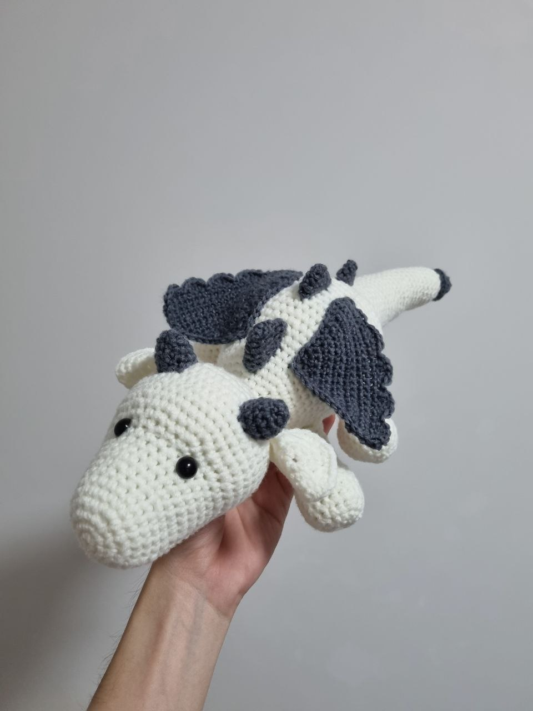
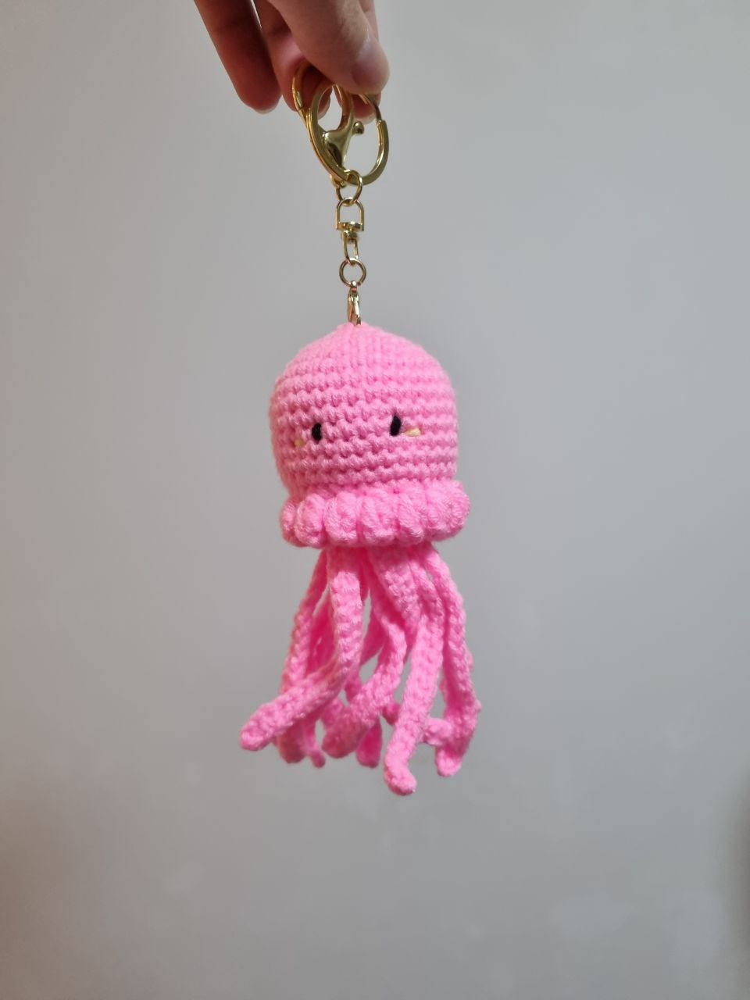
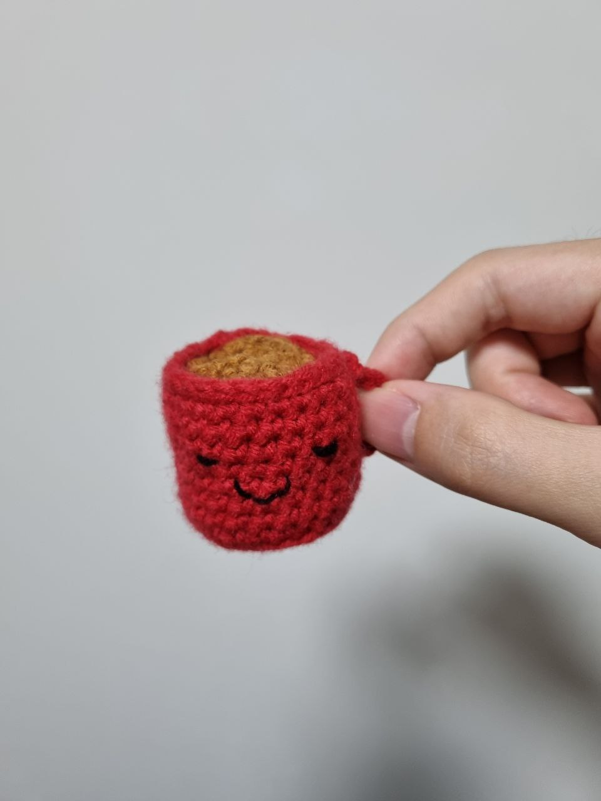
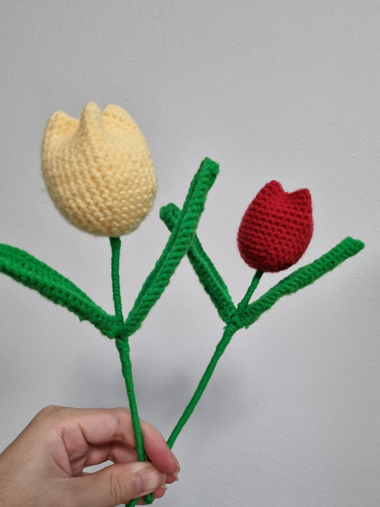

I first learnt about crochet in Dec 2022 and bought my first crochet kit set.
The set comes with the essential items such as the hook, clips and yarns as well as a youtube tutorial.
The first ever item i crochet was a small pouch. It took a few times of restarting to get used to the crochet method.

Initially, it was just to try out crochet with my sister, but it turned out to be something I could do in my free time.
Ever since, we slowly watch some online tutorial and bought more yarns to make other objects.
Below are some of my latest crochets.

### Recent Crochets


  
  
  
  


More crochets:
https://www.instagram.com/xenius.crochet/