## (2014) ART105 Art Processes

Module taken in DigiPen Year 2


  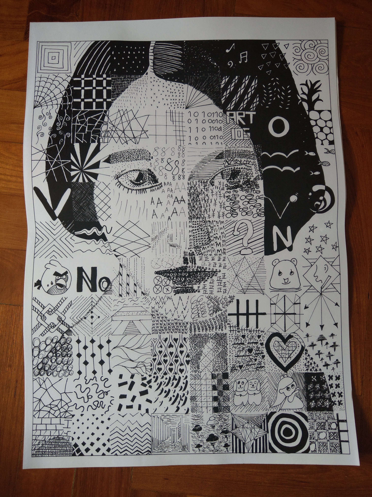


## (2014) DPD1901 Free Hand Drawing

Module taken in Temask Polytechnic Year 1


  
  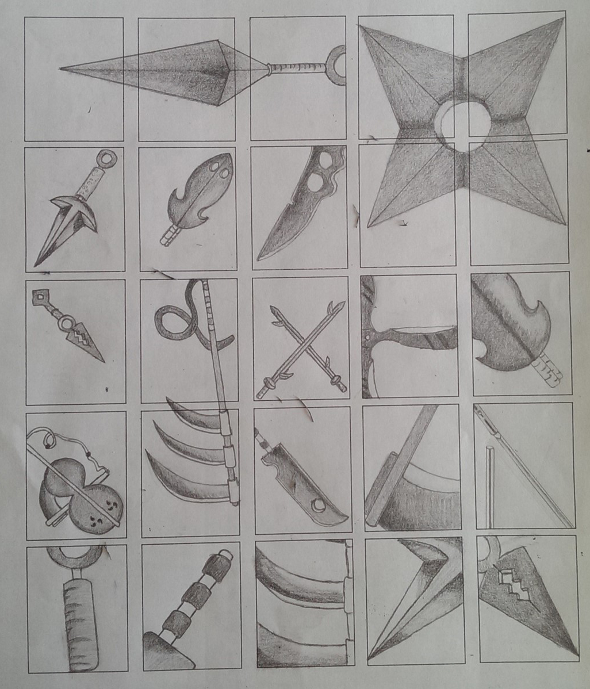
  
  


## (2014) Sketches

Random sketches done during my secondary school times


  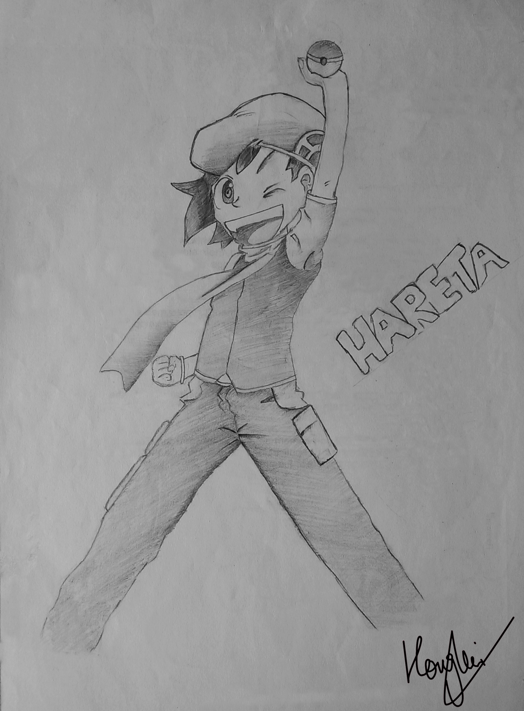
  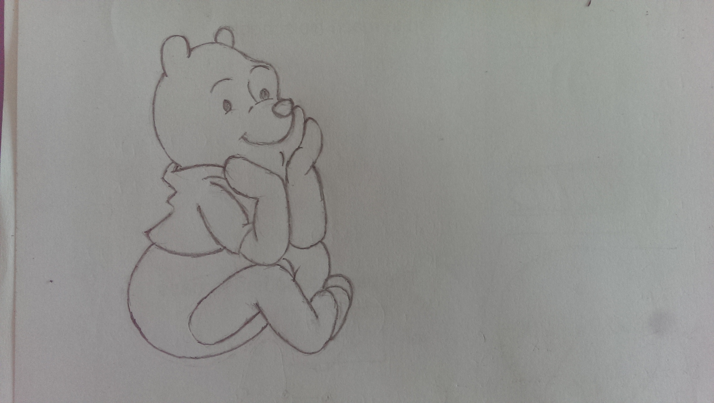
  
  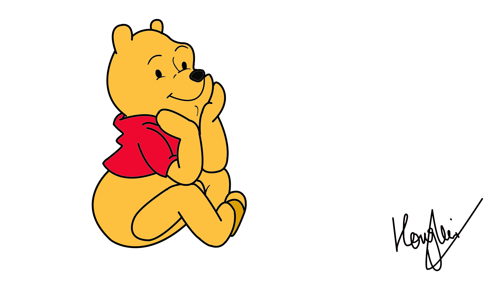
  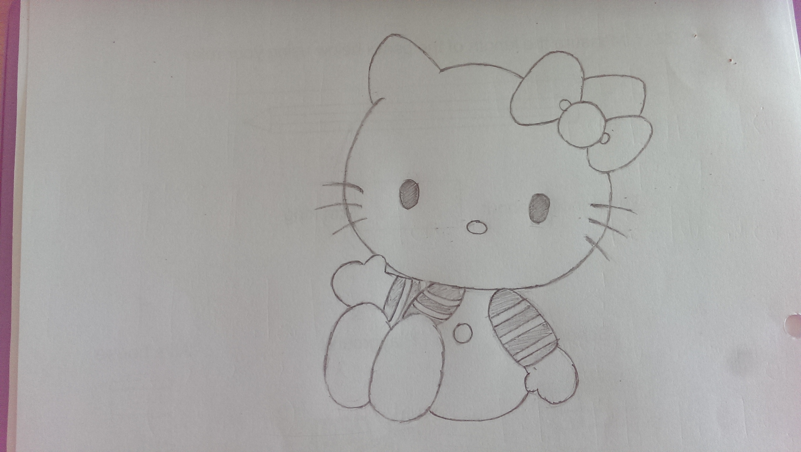
  
  
  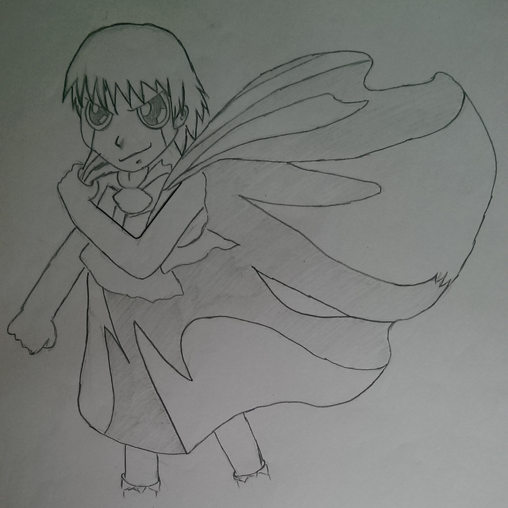
  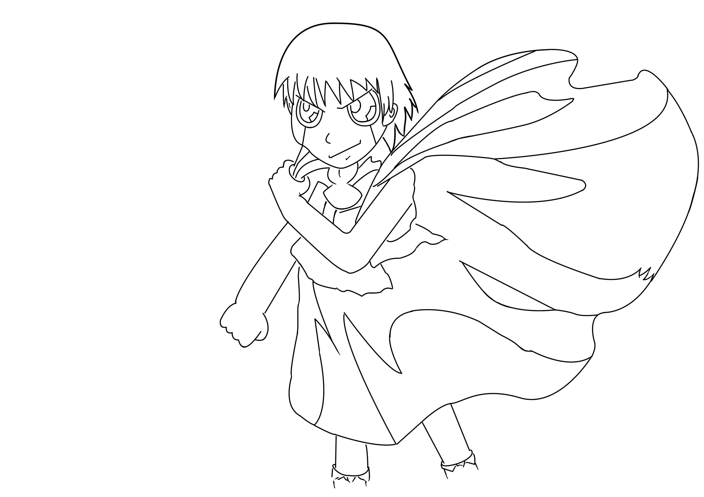
  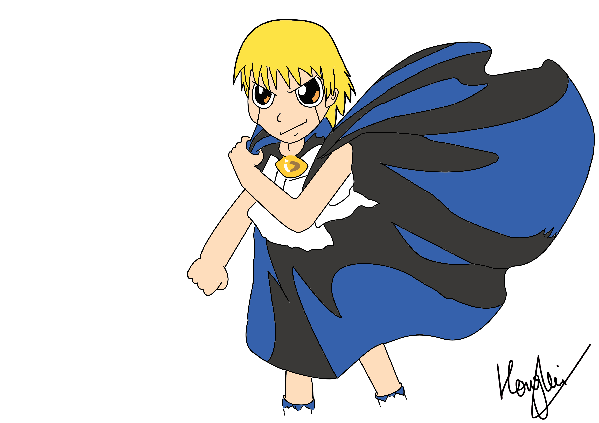
  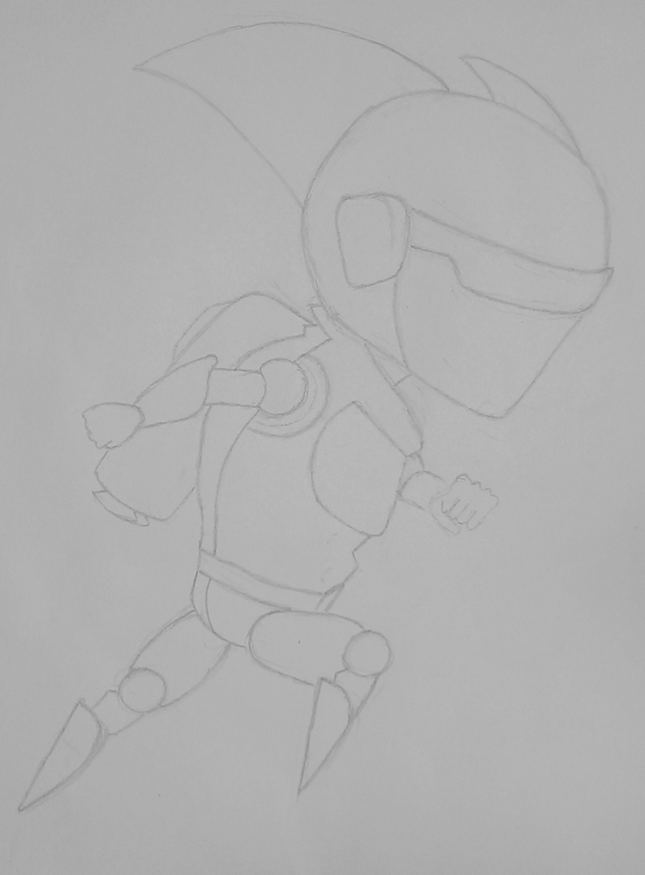
  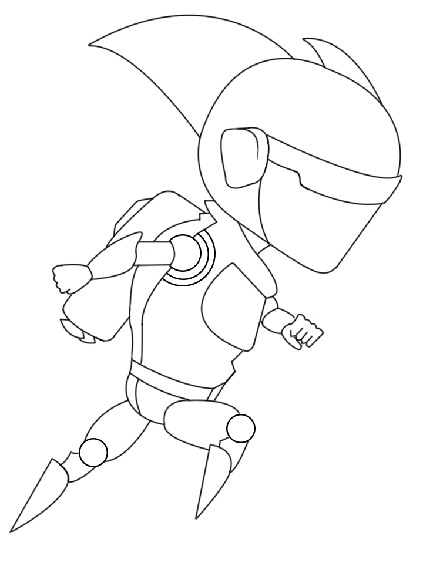
  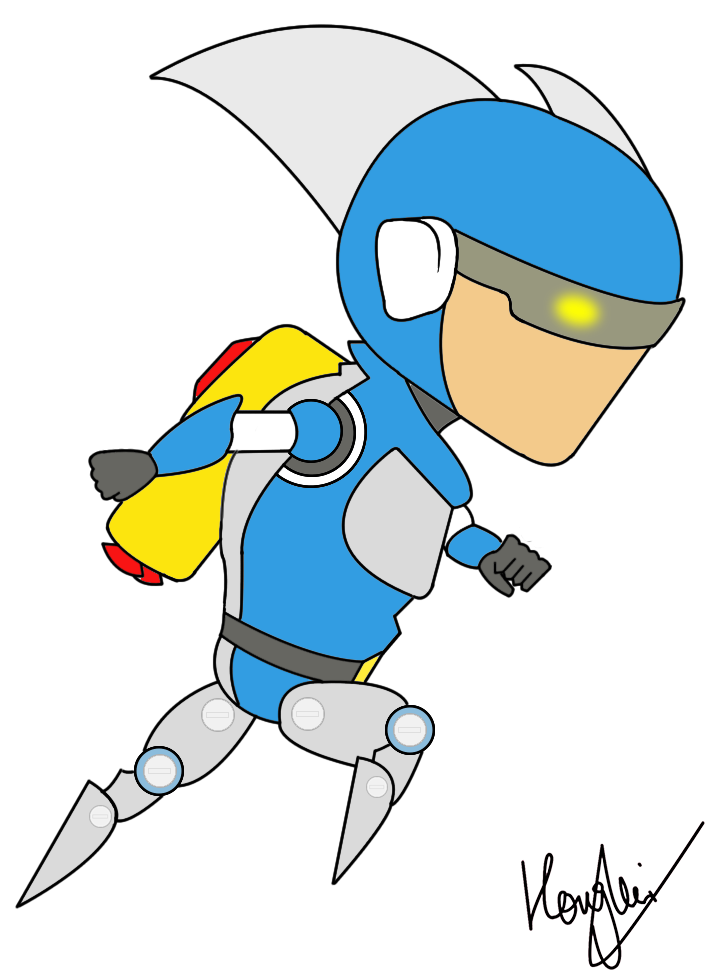
  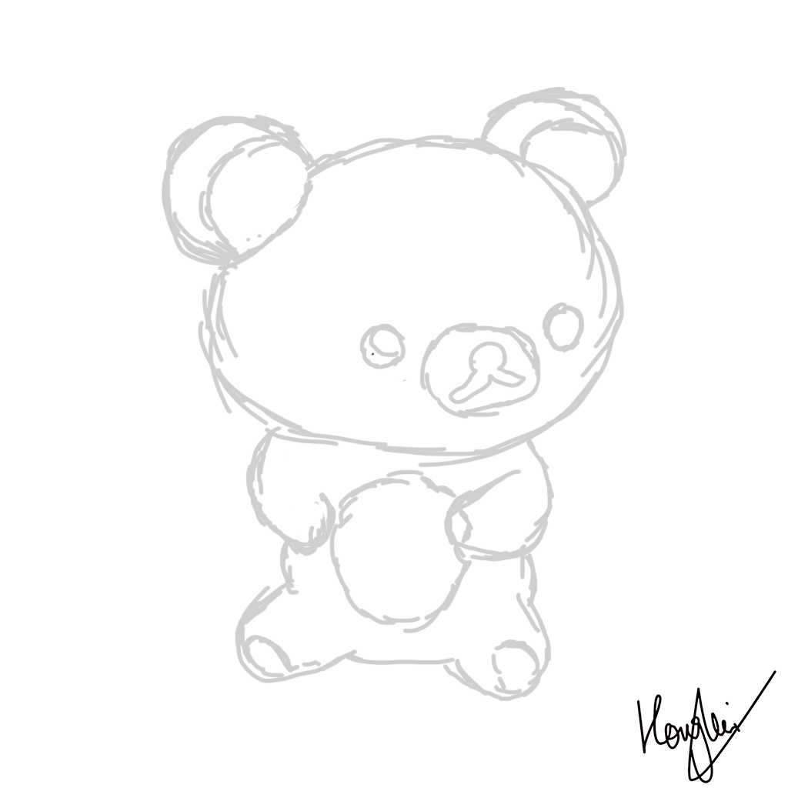
  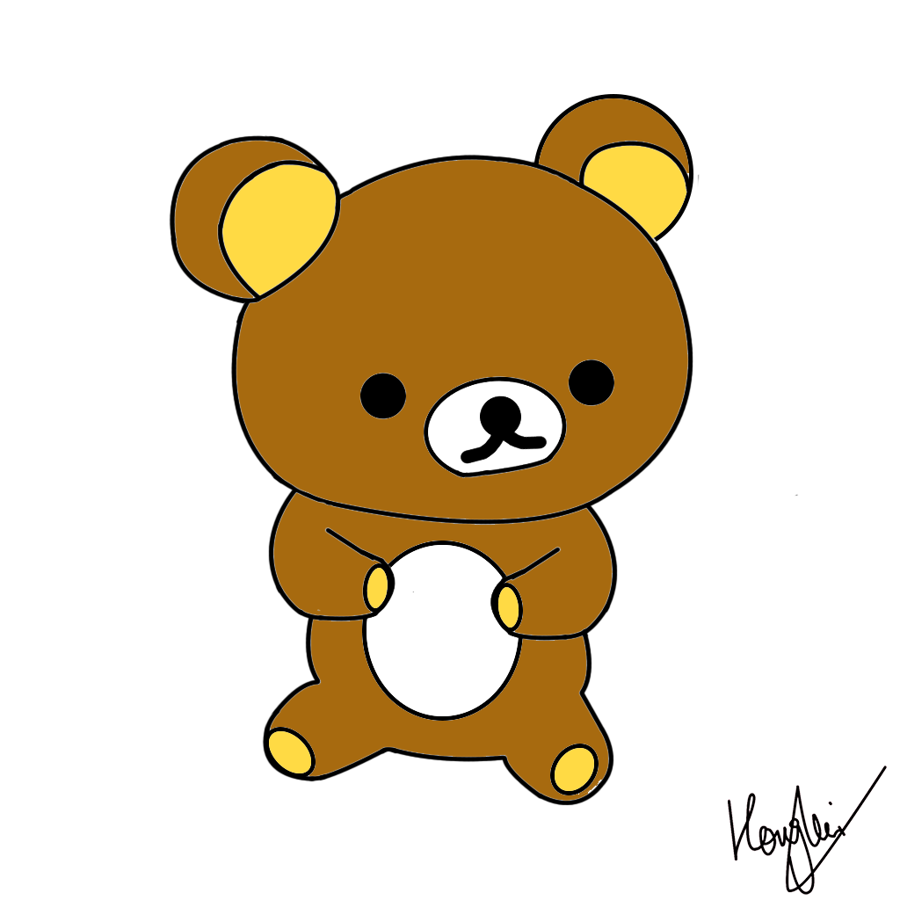

