## (2019) DigiPen Module - CG130

Module taken in DigiPen Year 2, CG130 3D Computer Animation Production I.
In this module, we are tasked to build any sci-fi machinery with modular parts. Hence, I've chosen to model a generator from a referenced image.
We were taught the basics of modelling and lighting in Maya 2019.

### Sci-fi Generator


  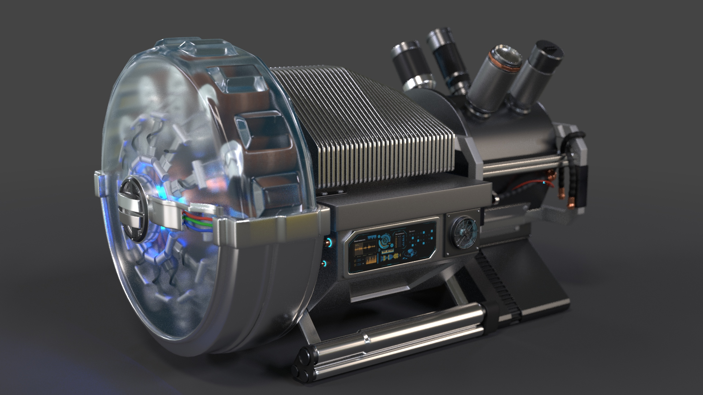
  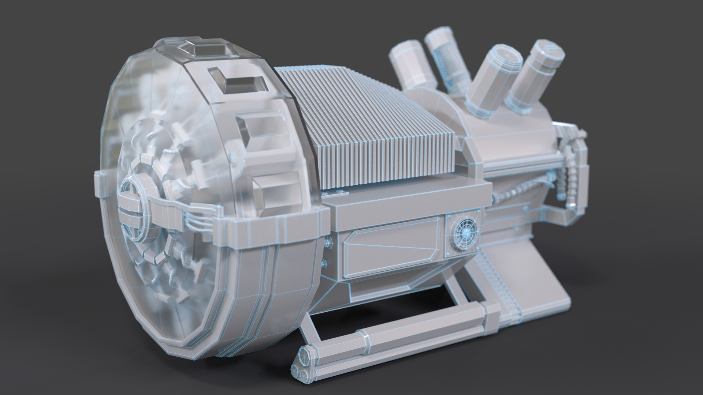
  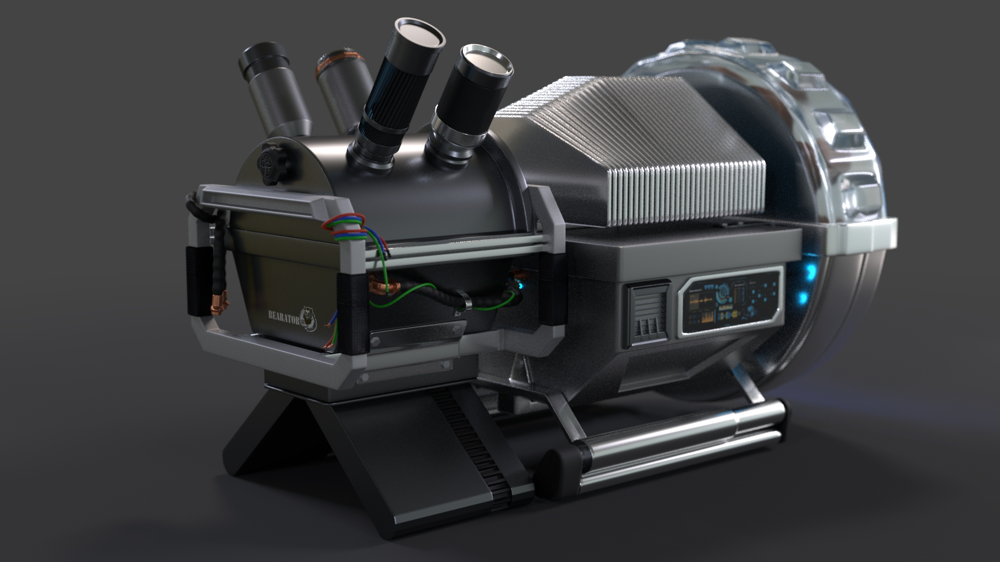
  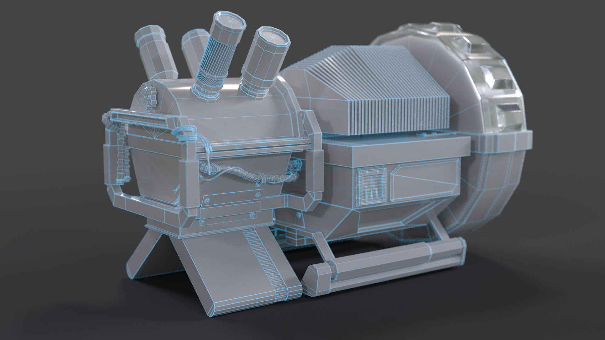
  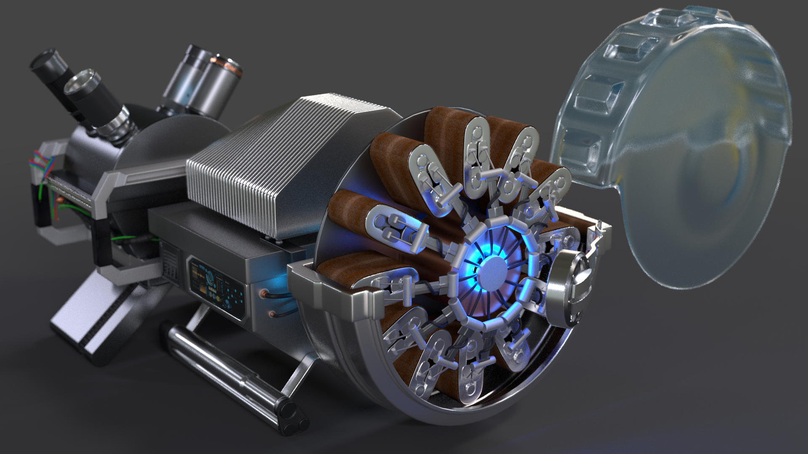
  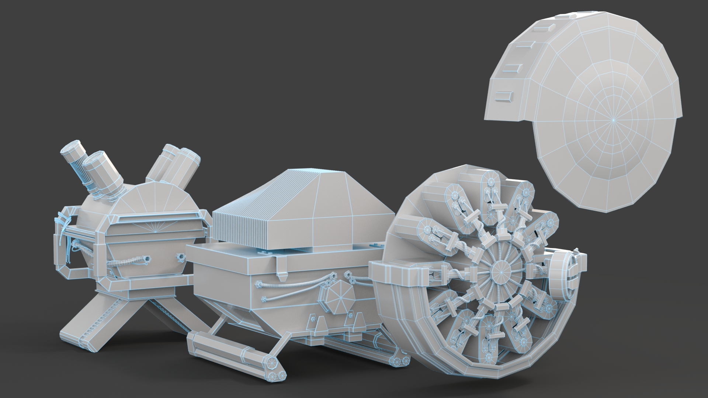
  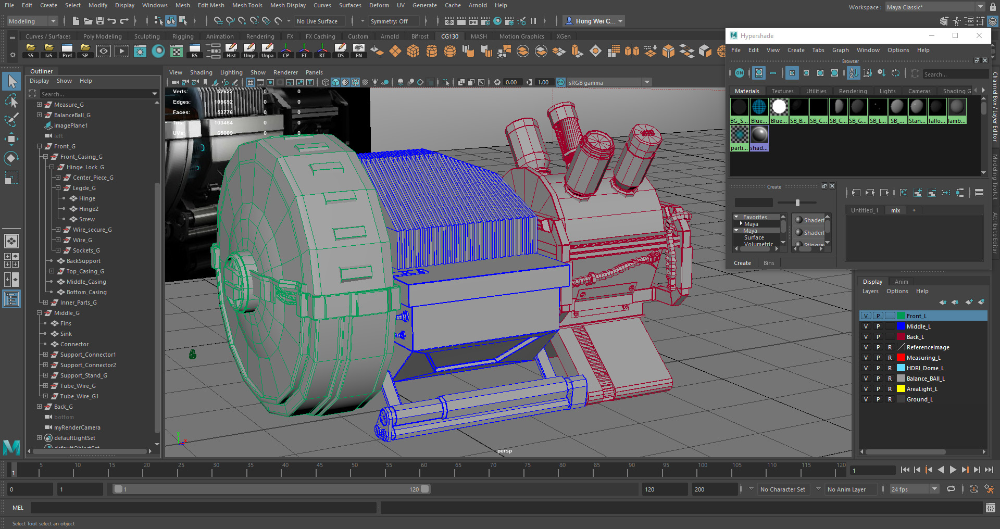


## (2015) Moonless Project

I participated in Project Moonless, a collaborative project between Swedish game developer [Fatshark Studios AB](http://www.fatsharkgames.com/), [Autodesk Inc.](http://www.autodesk.com/) and [Temasek Polytechnic](http://tp.edu.sg/).
I was assigned as an environment artist. The project lasted for weeks. During this weeks, I have modelled and textured a cannon and a balustrade.
Through this project I have learned more about modelling in Maya and the usage of Shotgun software.

More info : [Autodesk Case-Study: Taking game design education to new heights at Temasek Polytechnic](http://static-dc.autodesk.net/content/dam/autodesk/www/industries/education/docs/AUT-S282-SSTemasekPoly_A4Bro_V22.pdf)

### Balustrade


  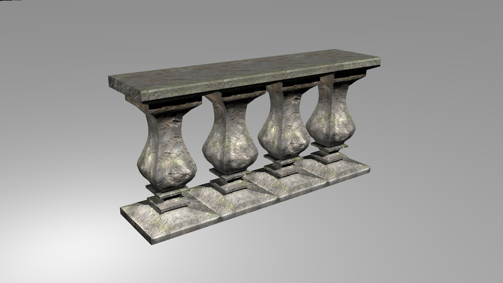
  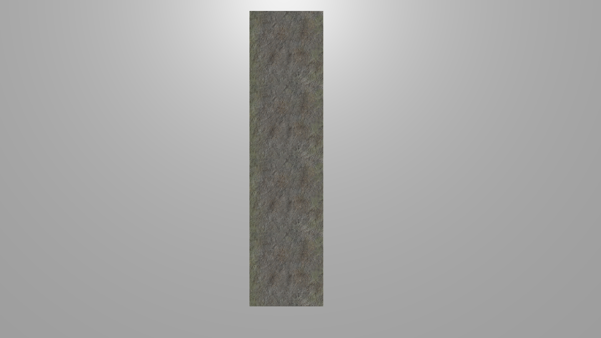
  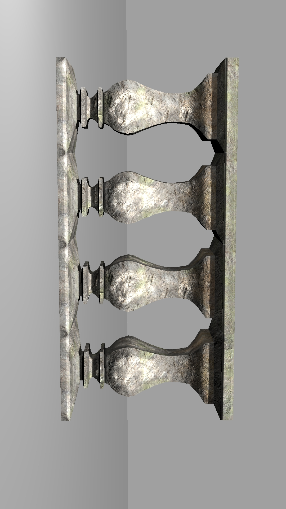
  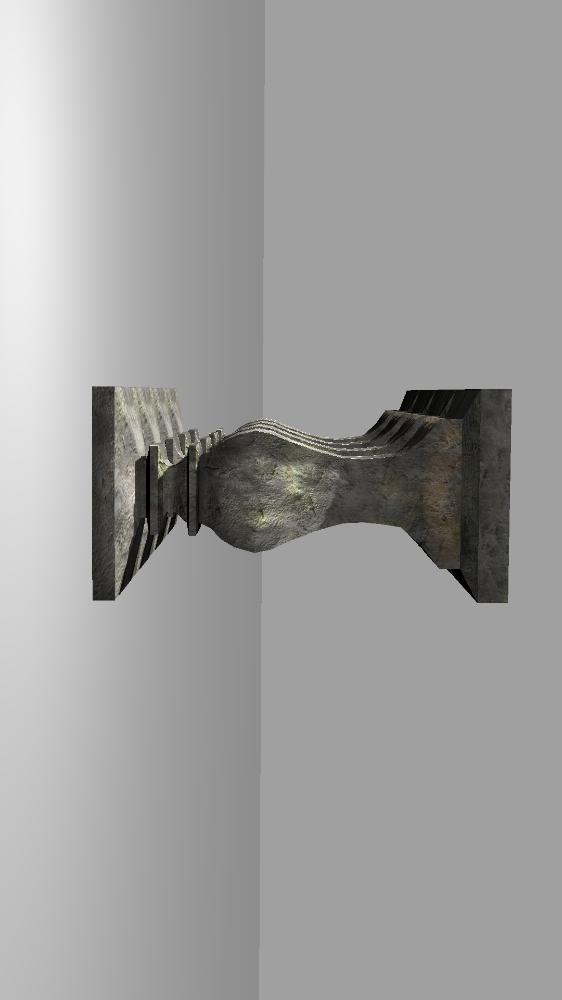


### Medieval Cannon


  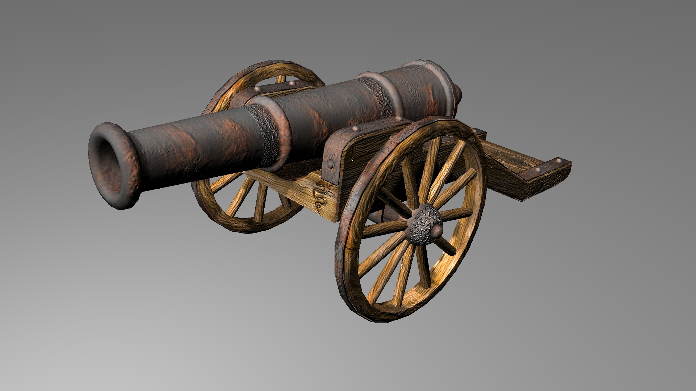
  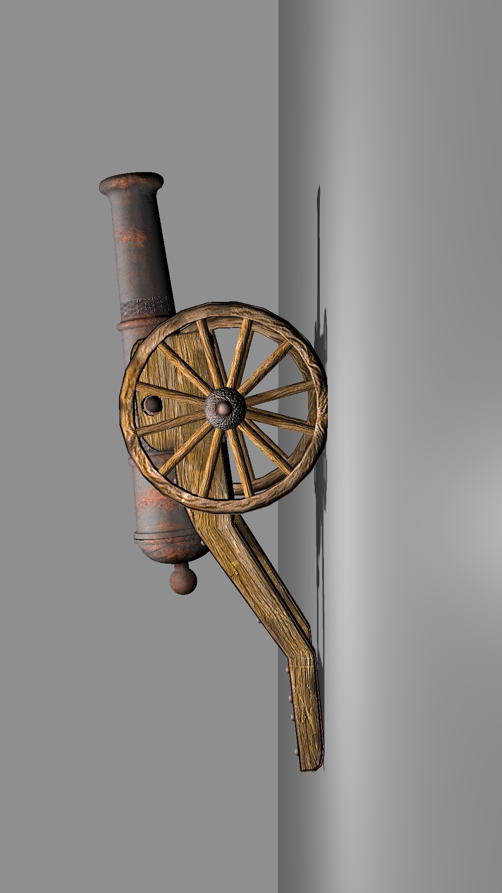
  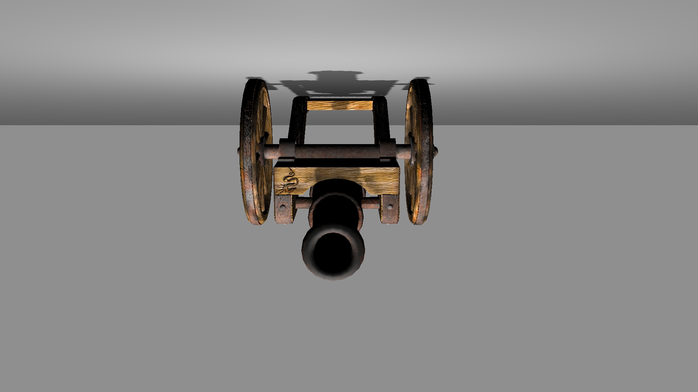
  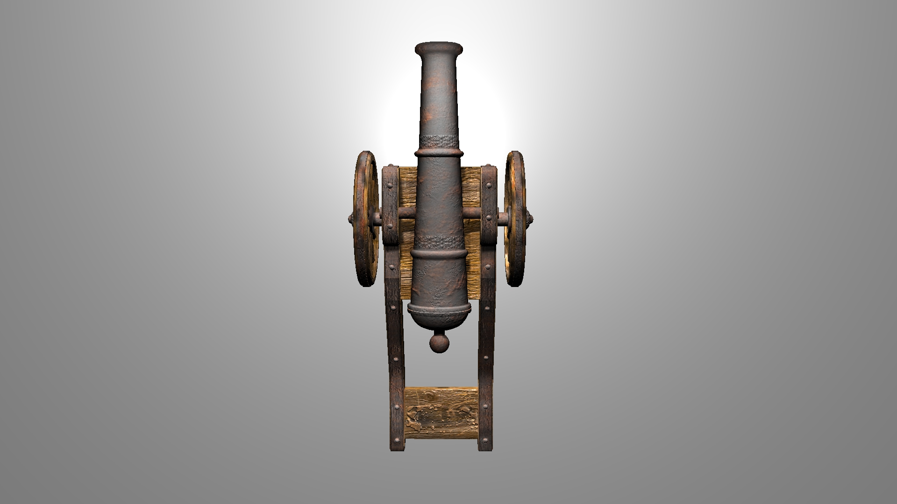


## (2014) Temasek Polytechnic Module - Game Modelling

Module taken @ Temasek Polytechnic Year 2, Game Modelling
In this module, we were exposed to props modelling, texturing and some best practices.

### Sci-fi Level



## (2014) Temasek Polytechnic - GTLA

Module taken @ Temasek Polytechnic Year 2, Game Texturing, Lighting and Animation
During this module, I have learned the basics of  texturing, character rigging and animation, and 3 point lighting. The model was provided by the lecturer without amendment from me.

### Orge texturing


  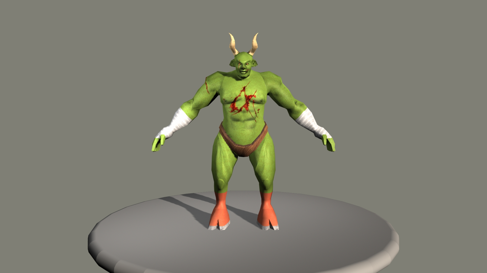
  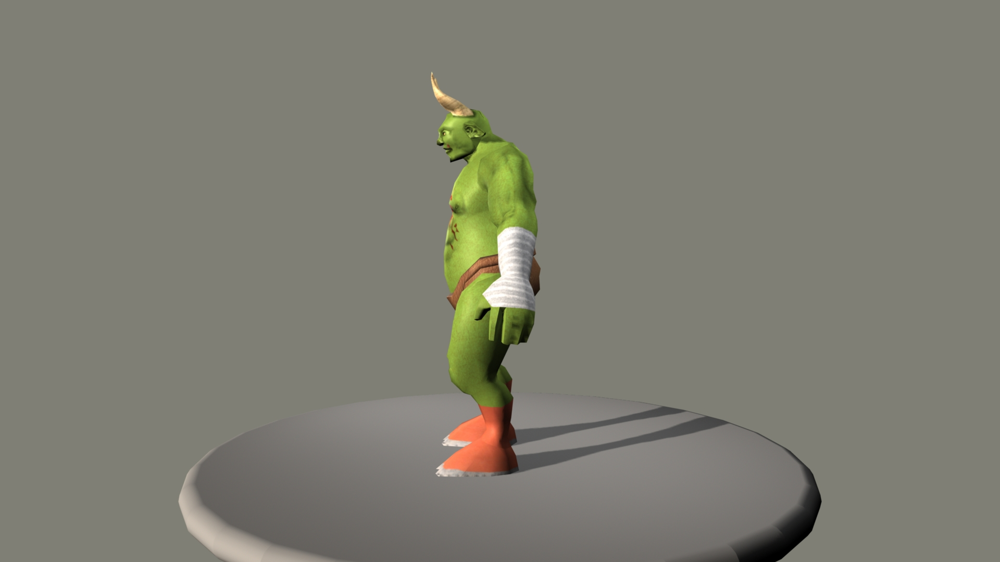
  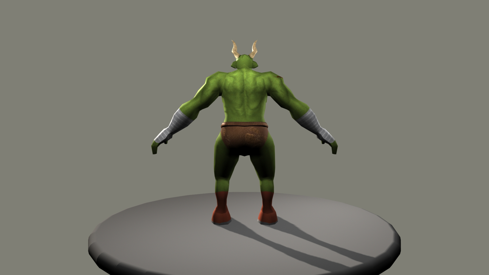
