## Description

Cosmic Hunter is a shoot 'em up game where the galactic bounty hunter that travels around the galaxy hunting down infamous marks in an attempt to repay an enormous debt.

Role : Level Editor/Base Engine

## Trailer



## Screenshots


  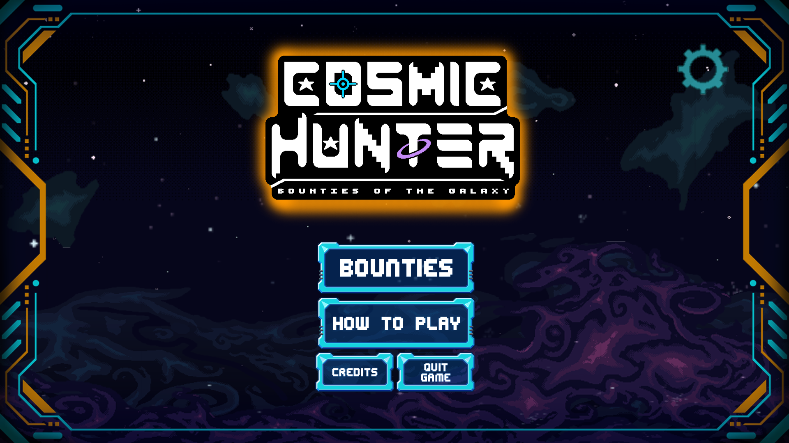
  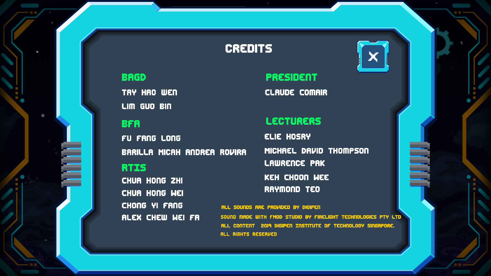
  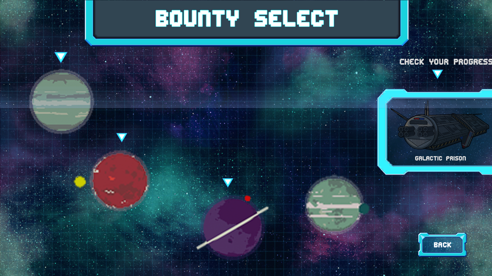
  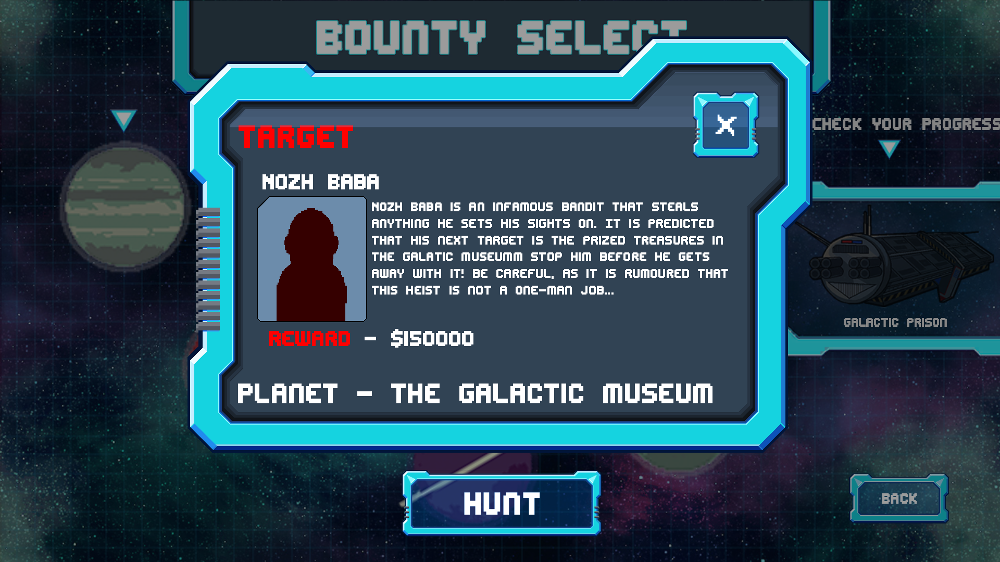
  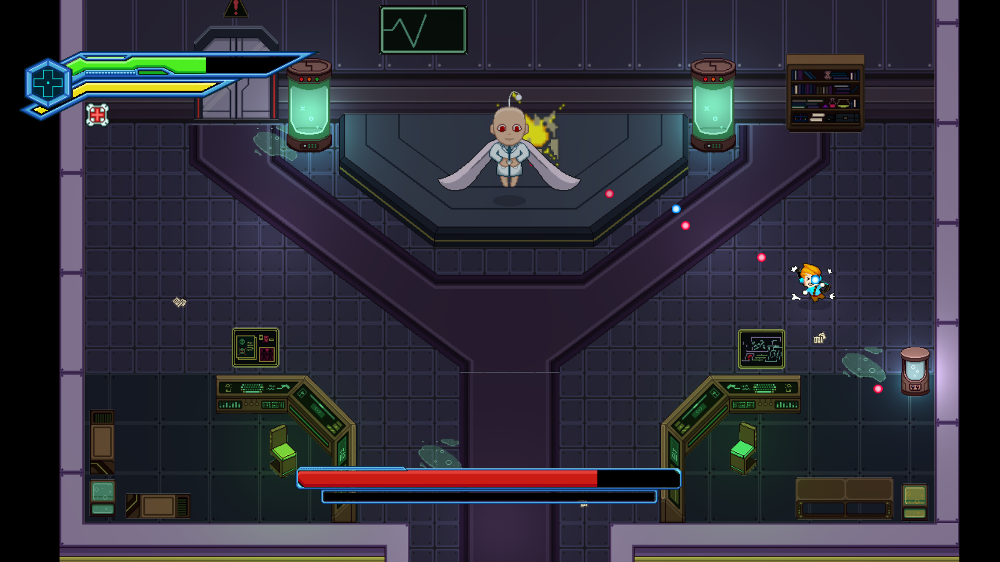
  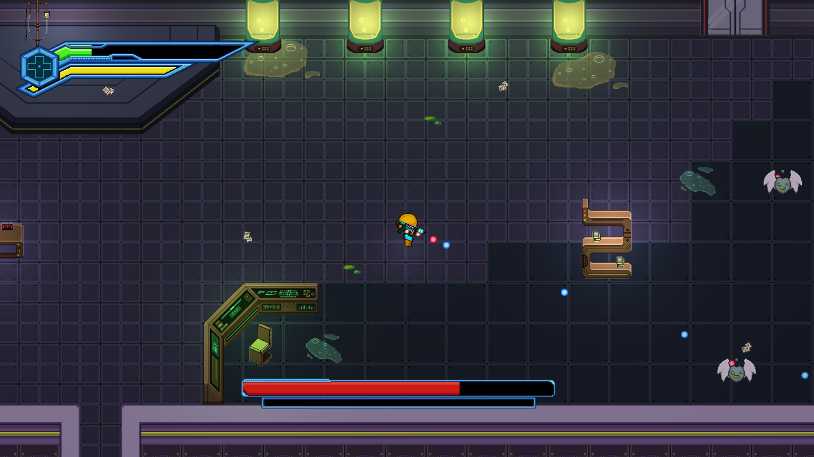
  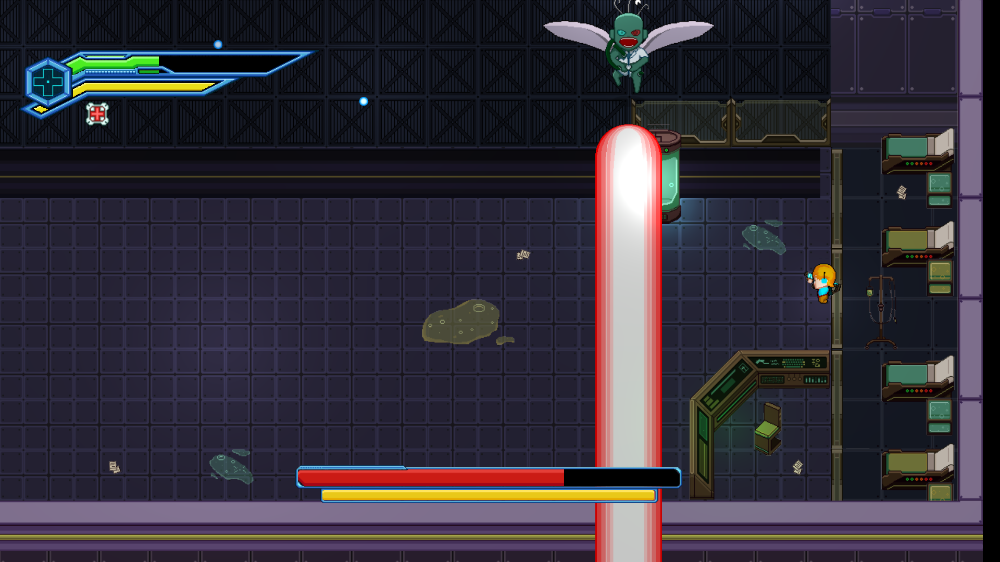
  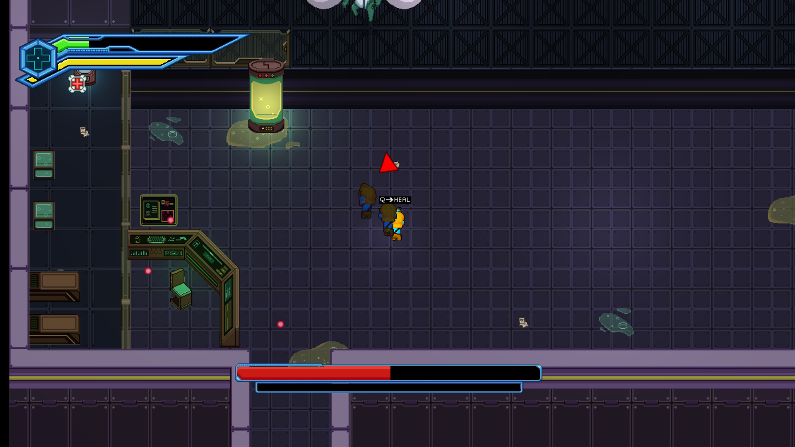
  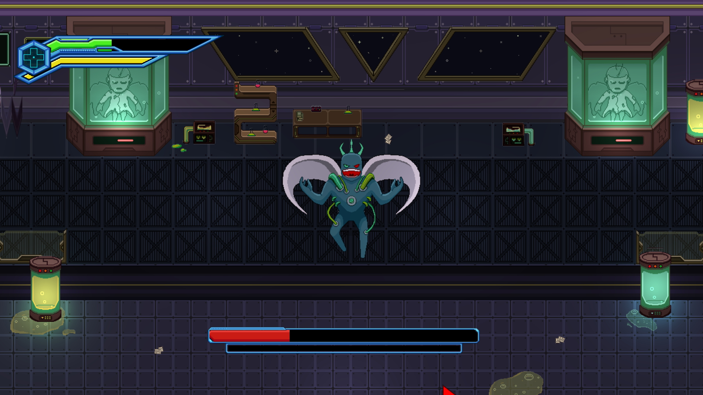
  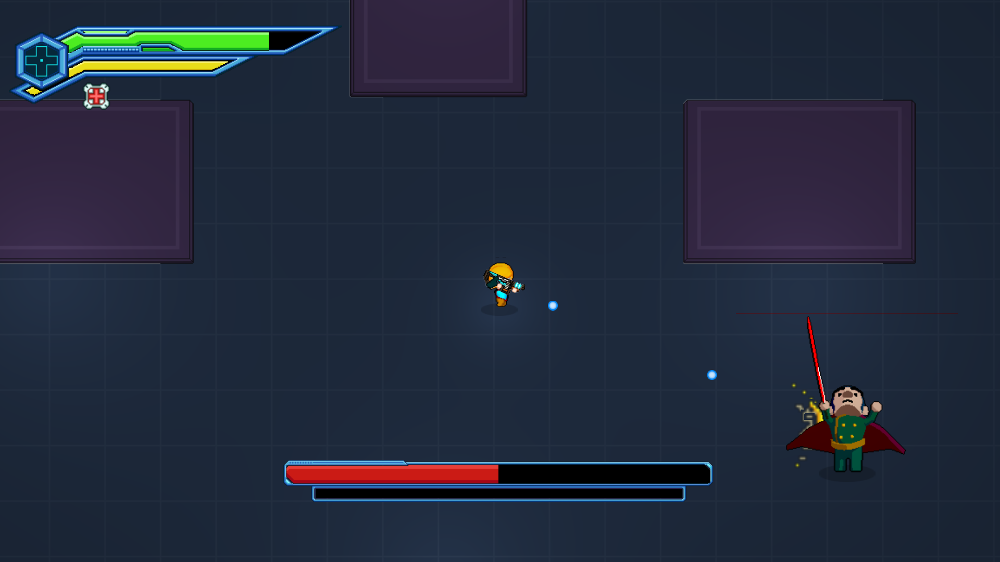
  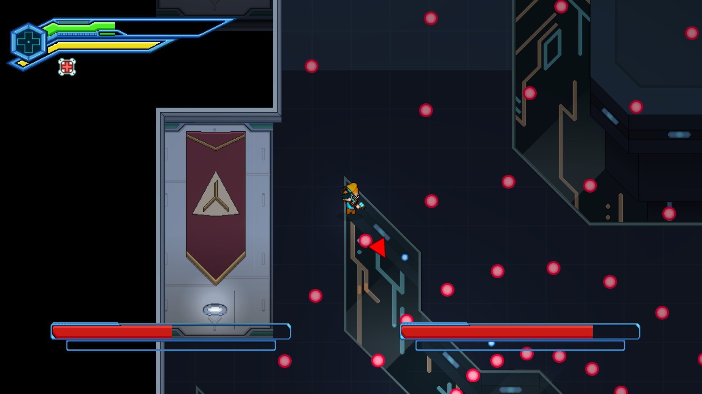
  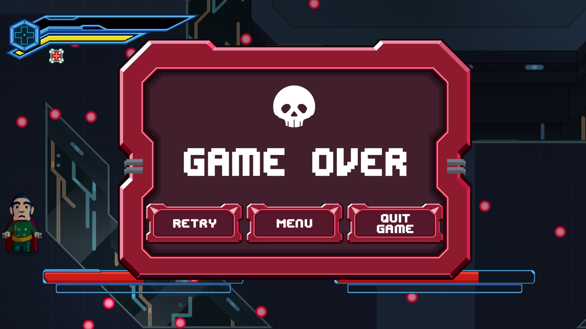


## Download


Win Executable
