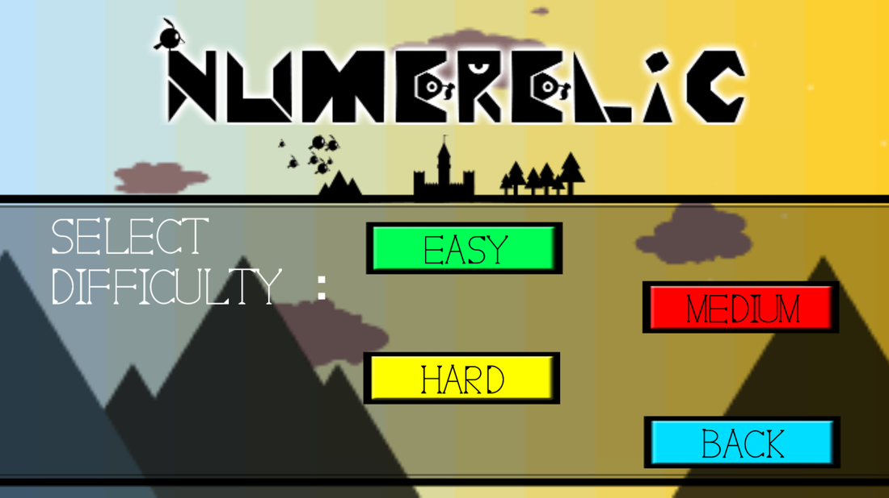
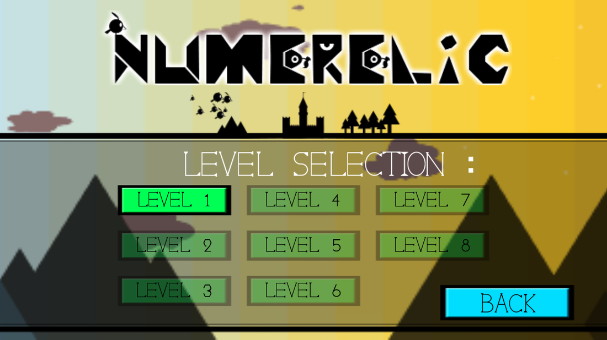
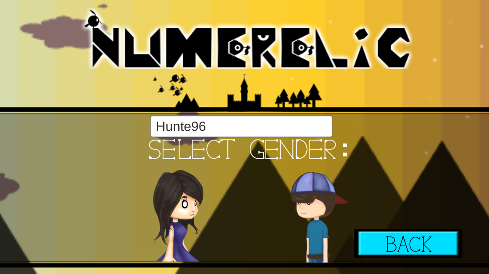
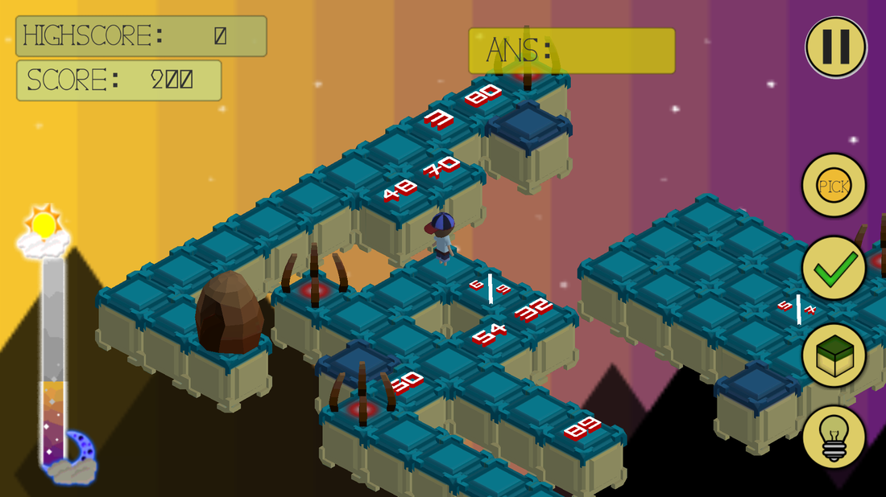
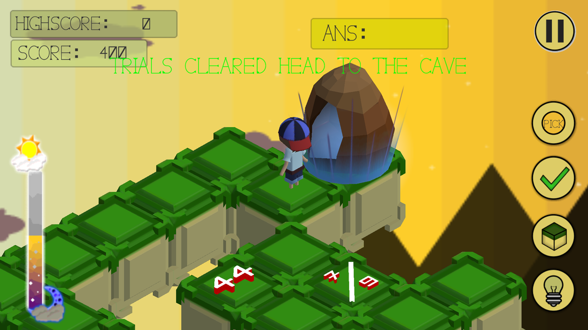
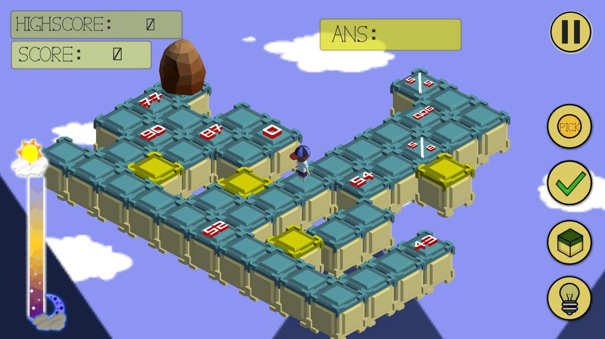
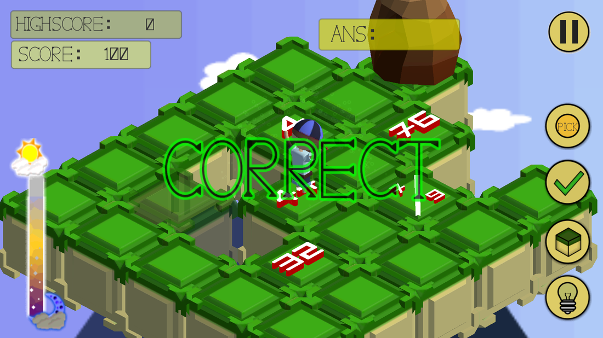
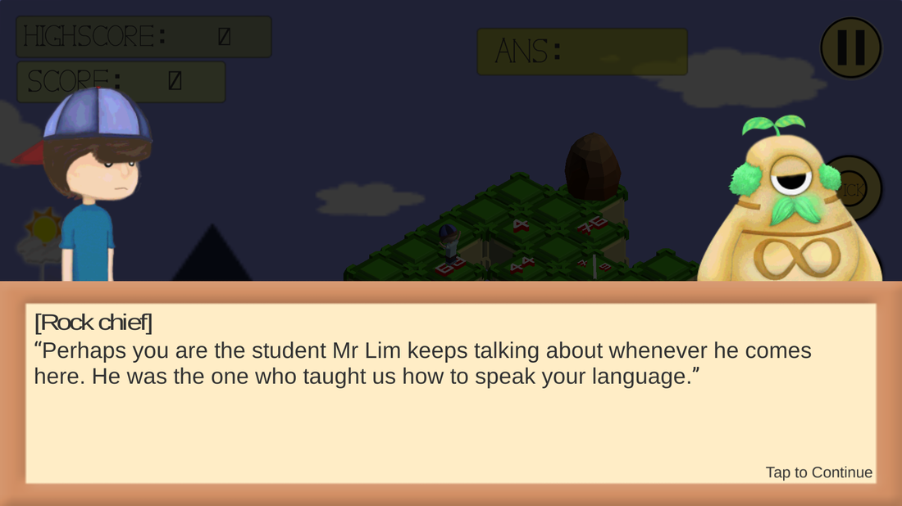

## Description

As a young talented student in Pasir Ris Primary School, with outstanding grades and excellent athletic skills. Sent to the realm of INTEGER, the player's only hope of making it back is to traverse their bizarre puzzle world of mathematics and locate the statue of Numerelic, God of Integer and make a wish upon the statue to return to your dimension.

Players will have to solve puzzles (Questions/Problem Sums) of the ruins to advance to next level and find the God of Integer. Player have to plan and strategize their moves carefully to prevent them from getting stuck.

Role : Programmer

## Screenshots


  
  
  
  
  
  
  
  
  


## Gameplay



## Download


Android APK

 
<snap></snap>


Win Executable

