## Description

Spiritus is a 3rd person adventure/exploration game with puzzle elements.
Set in a world where toxic fumes and unbreathable air have seeped into the bowels of planet, an Automaton constructed by the planet's previous inhabitants awakens deep underground.
Left with neither purpose nor memory of his previous masters, the Automaton wanders the caverns eventually stumbling upon a young sapling containing the spirit of Nature.

Role : Producer/Level Editor/AI

Link to DigiPen Games Gallery: https://games.digipen.edu/games/spiritus

## Trailer



## Screenshots

### Editor


  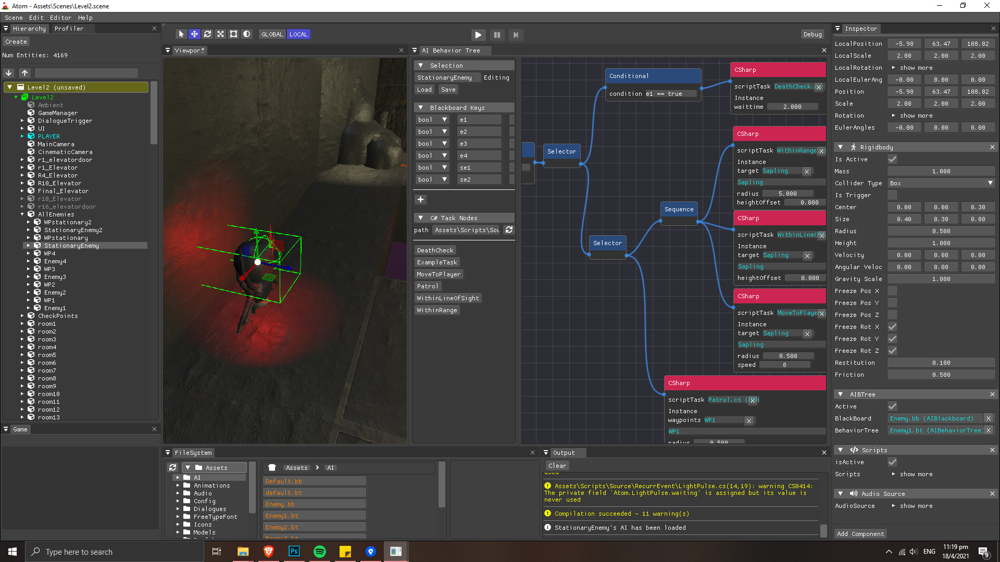
  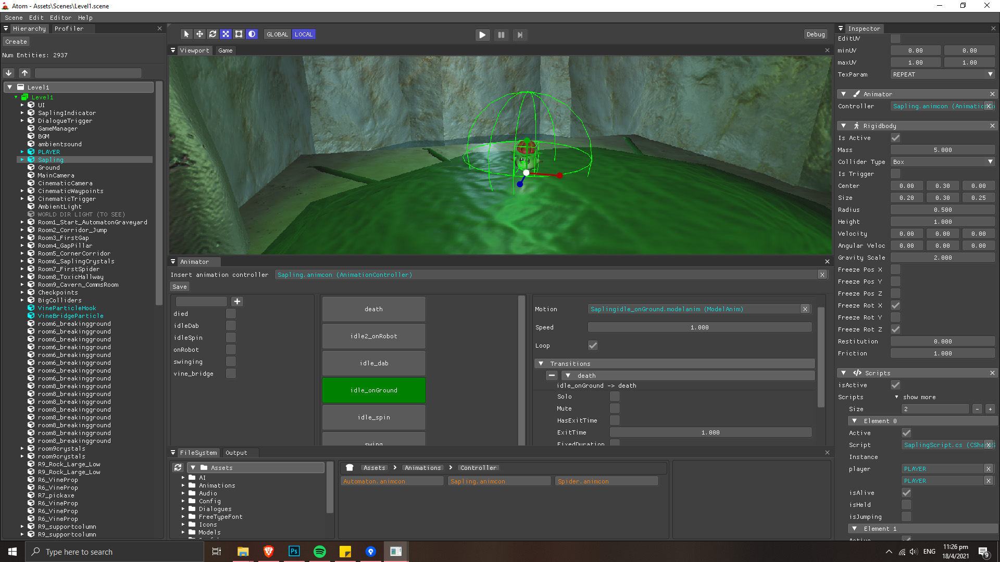
  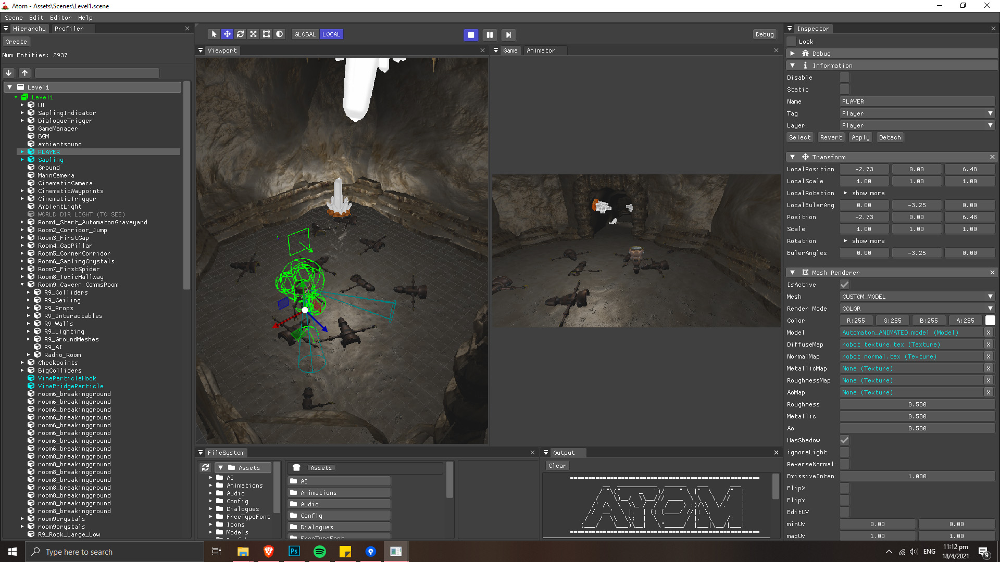
  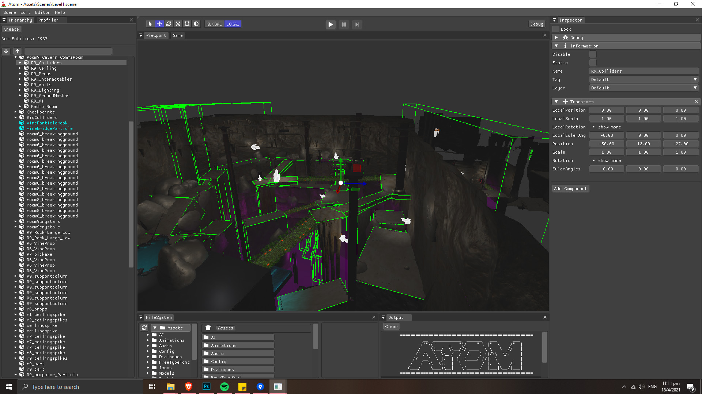
  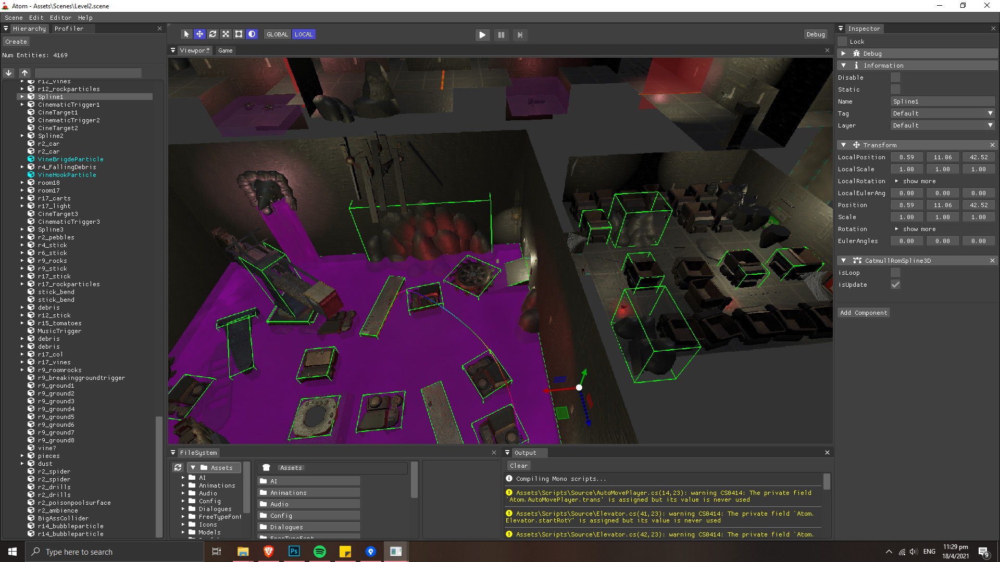


### Gameplay


  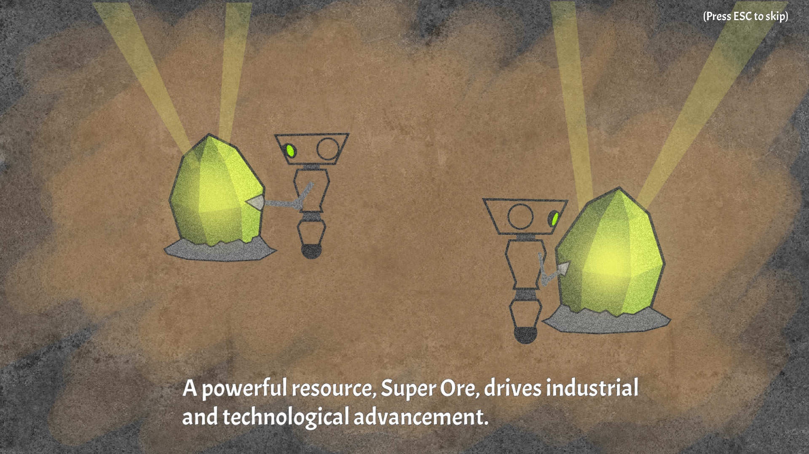
  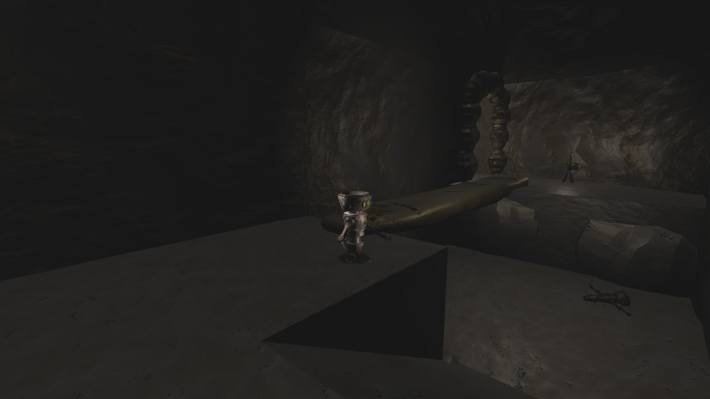
  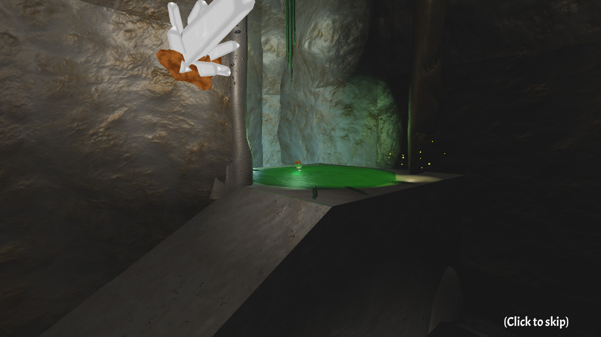
  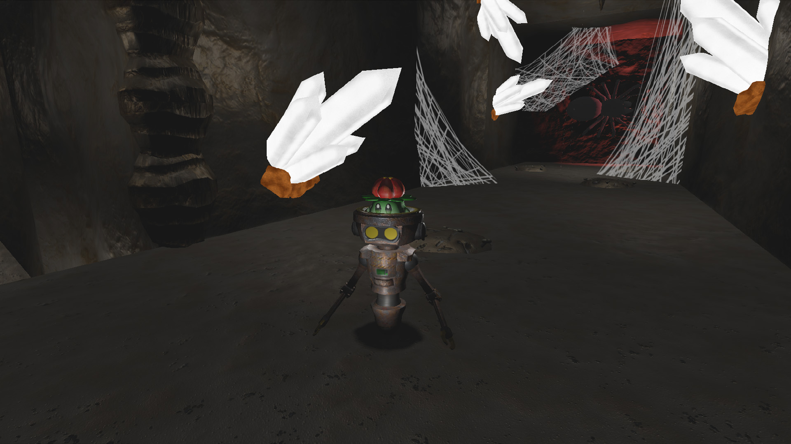
  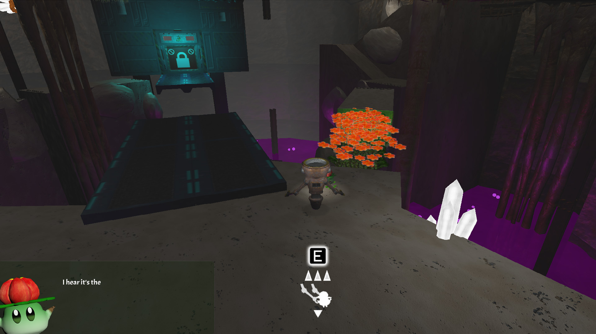
  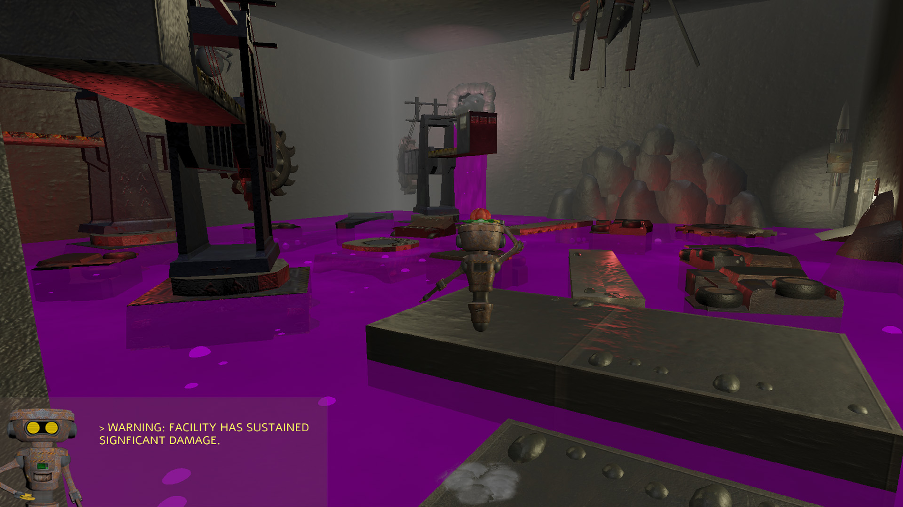
  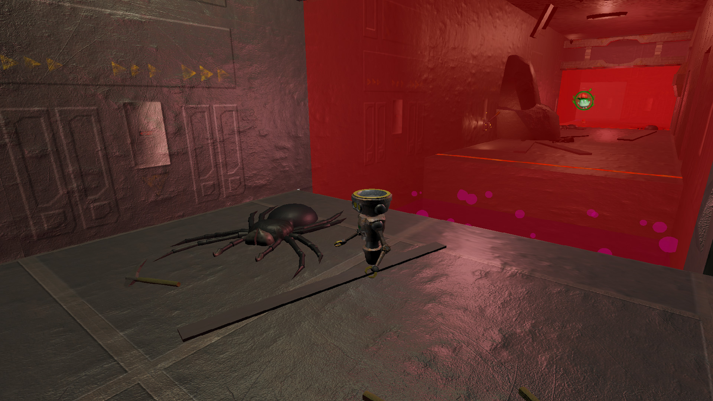
  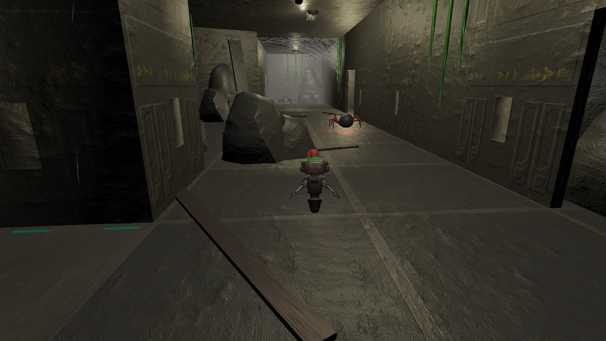
  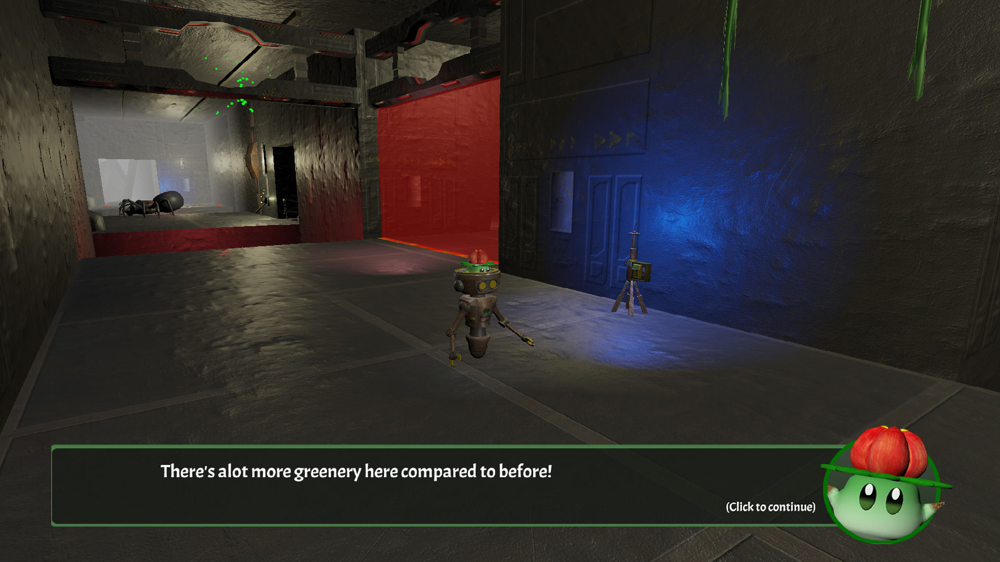
  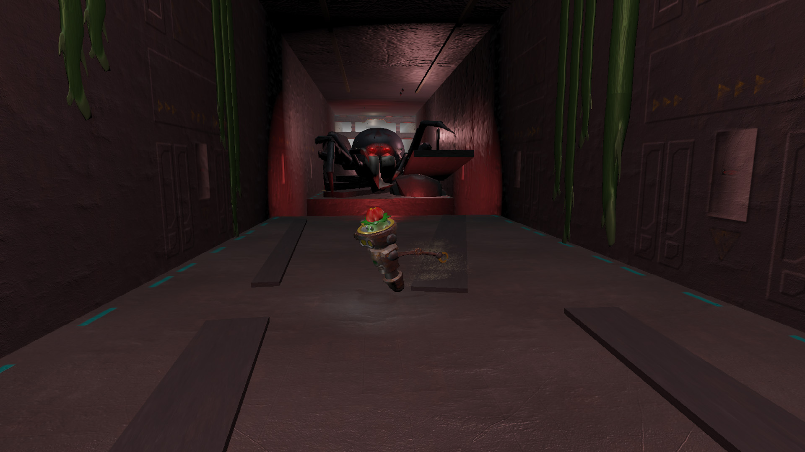


## Play through



## Download


Win Executable (save link as...)
