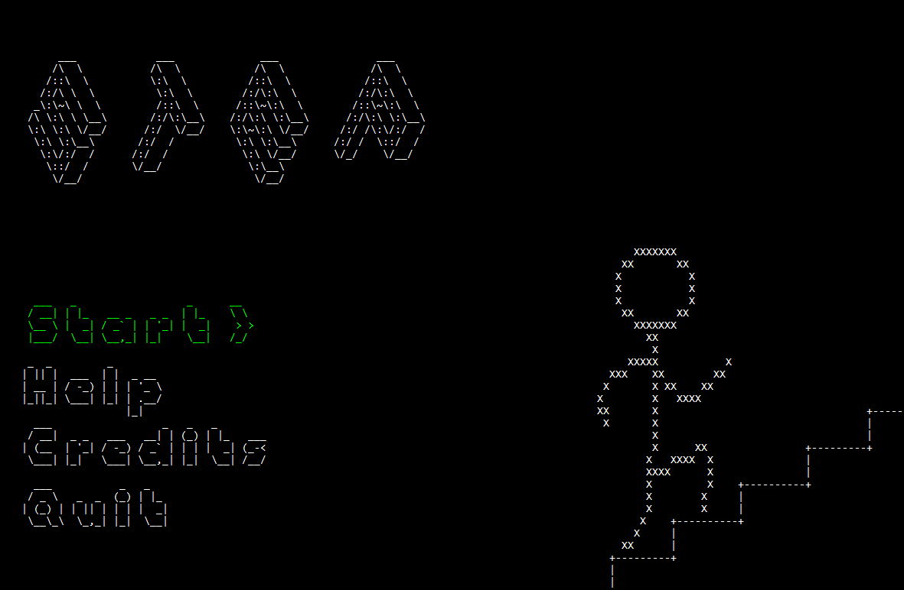
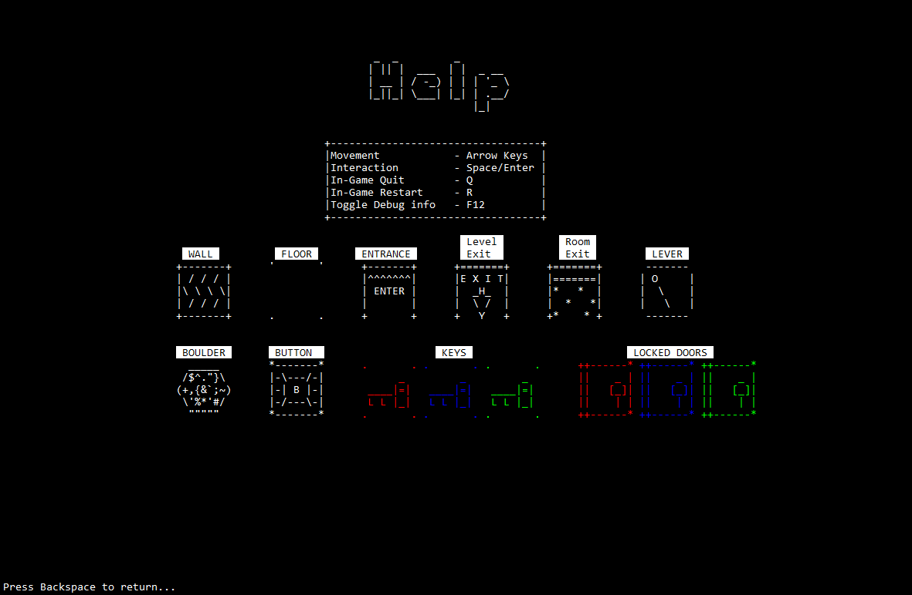
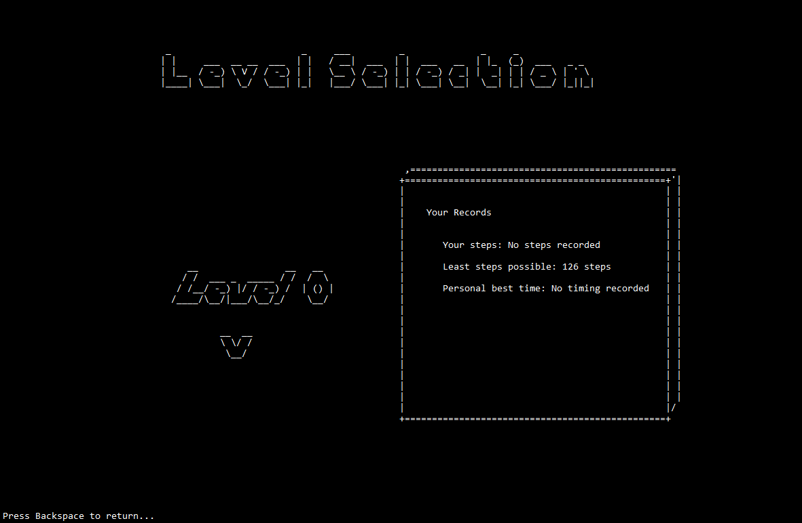
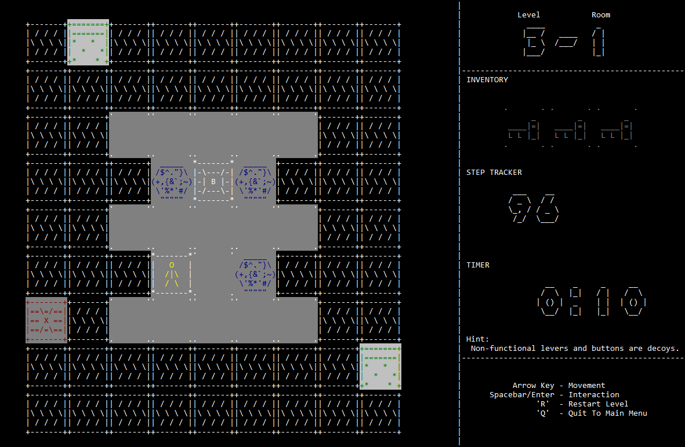
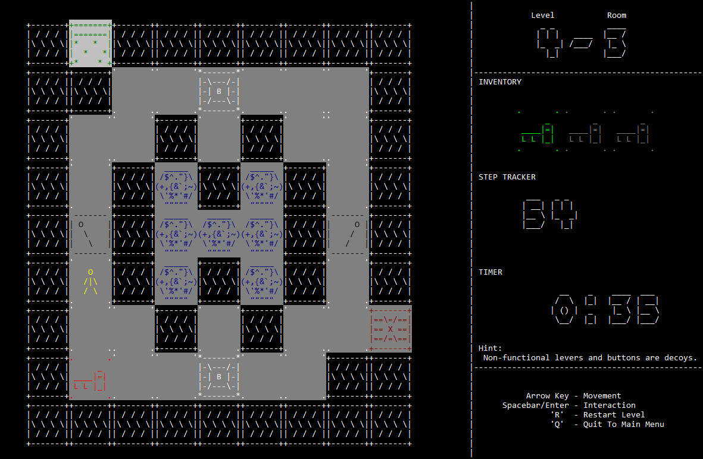

## Description

STEP is a 2D puzzle/adventure game. Player's goal is to find a way out of the cave.

As level progress, player will be introduced to more mechanics. In addition, at later levels, there are multiple path for the player to choose, based on the path chosen, it will take different amount of steps to reach the exit. Player's aim is to reach the exit with the fastest timing and least steps.

Role : Graphic Designer/Base Engine

## Screenshots


  
  
  
  
  


## Download


Win Executable
