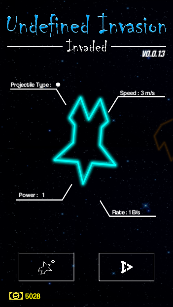
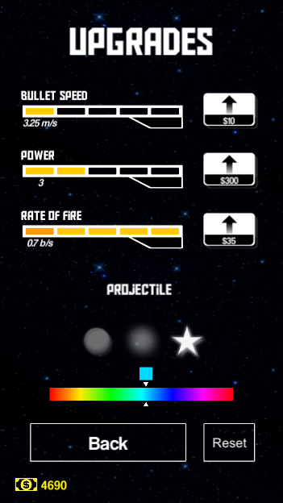
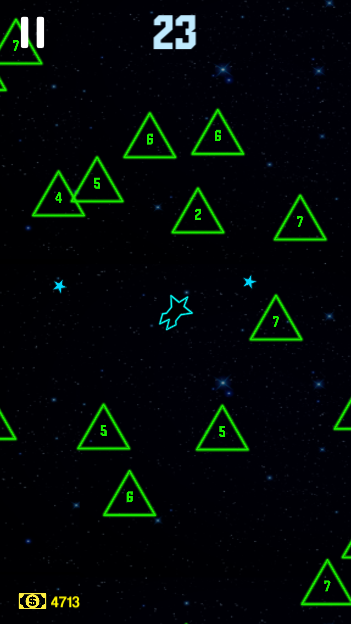
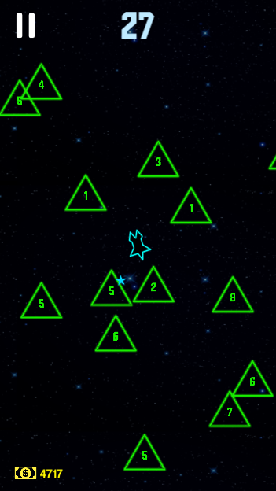
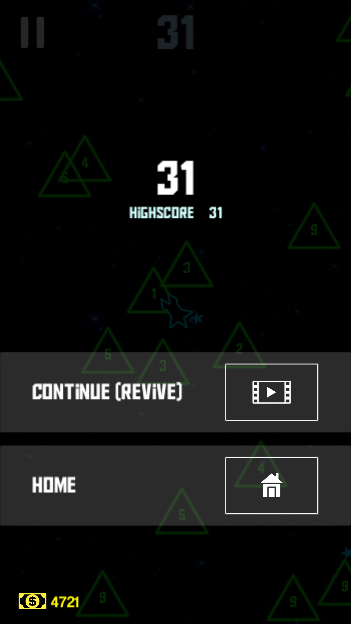

## Description

Undefined Invasion - Invaded is a sequel to the first version of the game (Undefined Invasion) made in 2015. The main different is that it's a mobile game and player only controls the ship's shooting direction using a joystick.

## Screenshots


  
  
  
  
  


## Download


Playstore (Unavailable)
