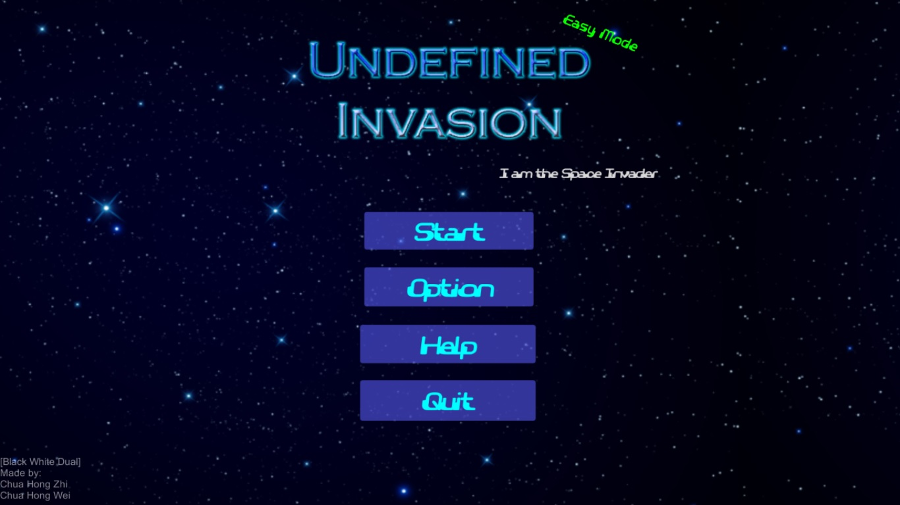
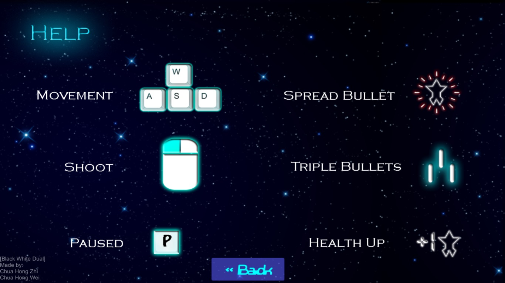
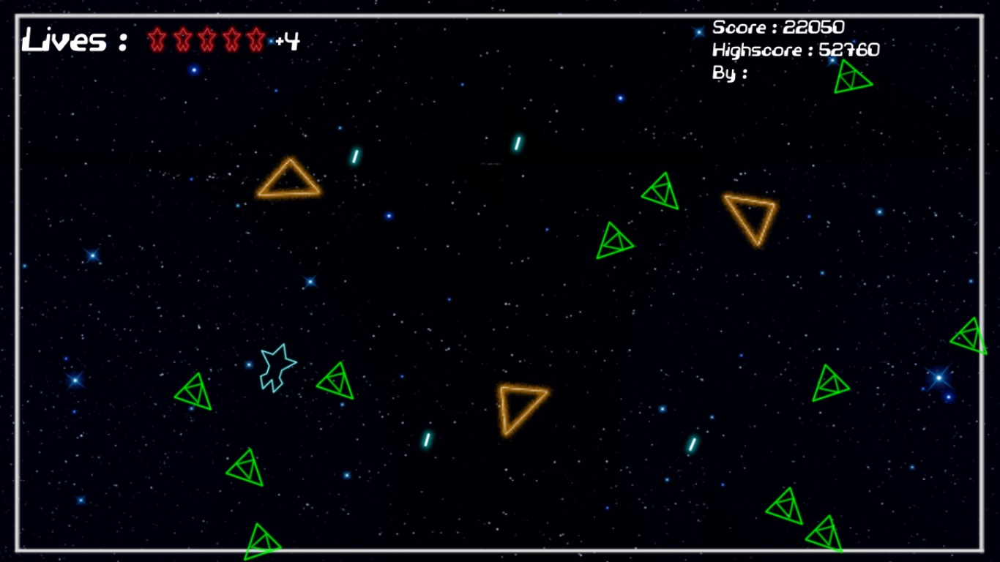
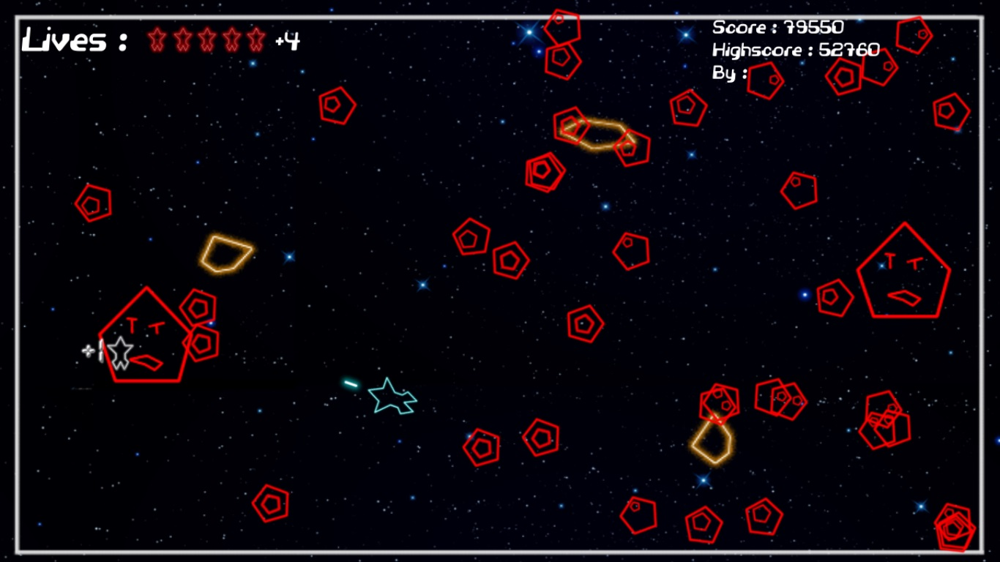
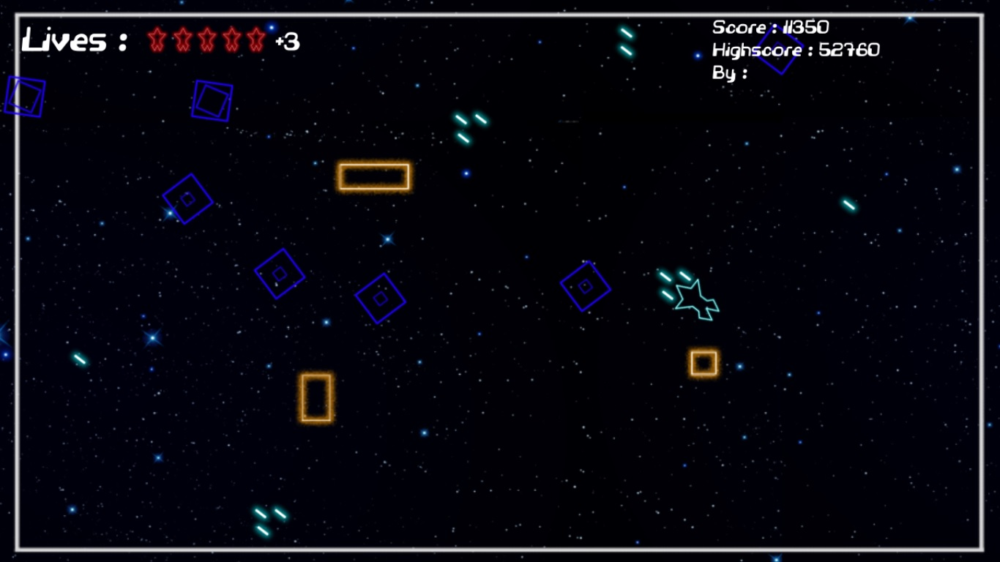

## Description

Undefined Invasion is 2D top-down shooter game made within 48 hours during an event host by our course mates. You, as an undefined shape is hunted by other defined shapes (triangle/square/pentagon/hexagon). Eliminate all other shapes and escape.

As the game progress, there will be more tougher enemies, but player will also have different power-ups that will spawn randomly on the map.

## Screenshots


  
  
  
  
  


## Download


Win Executable
