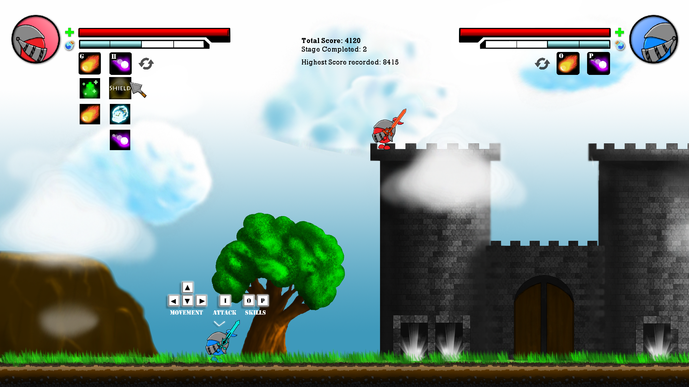
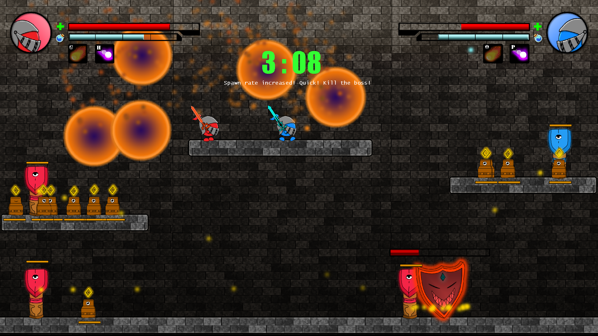
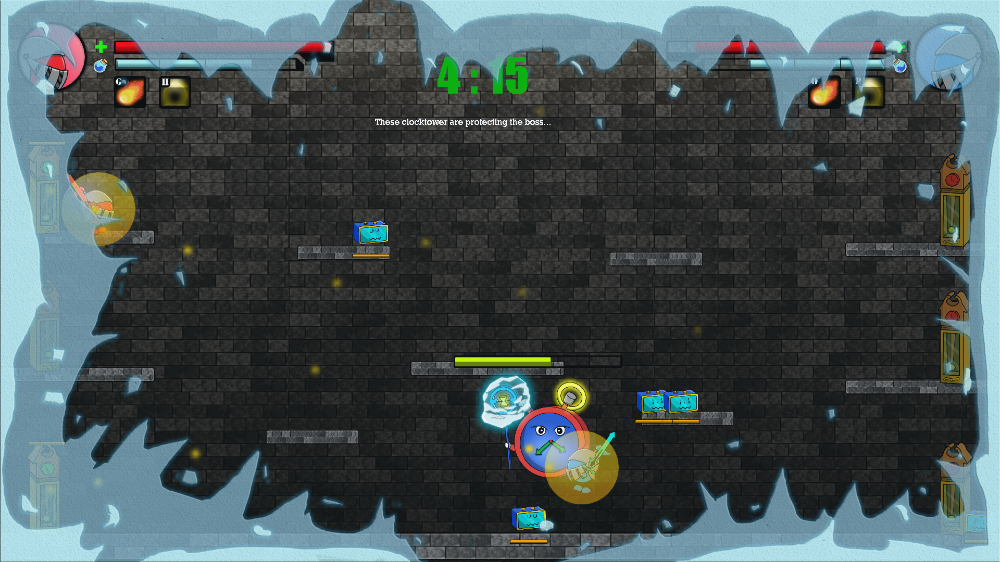

## Description

Yippy's Fortress is a 2D co-op platformer game whereby 2 players must work closely together and defeat the bosses on each floor to progress up the fortress until the final boss is defeated. The objective of the game is to defeat each boss swiftly, which requires teamwork and strategy. Players have different skills with 2 effects for each skill based on whether if it is casted by a single player or both player at the same time.

Role : Game Designer/Base Engine

## Trailer



## Screenshots


  
  
  


## Download


Win Executable
